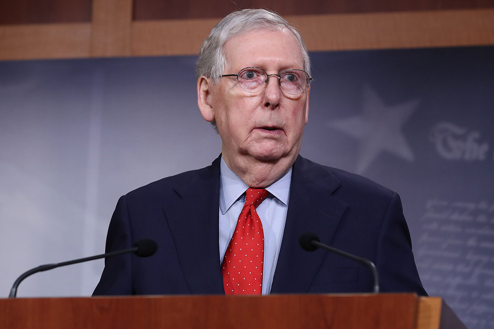

```{r setup, include=FALSE}
knitr::opts_chunk$set(echo = FALSE)
```

Chapter 1 gave some specific examples of strategic games and strategic thinking. In this chapter we will 

- discuss the timing of players' actions
  - e.g. highlight the differences between two *pure* game types 

- Define some basic terminology  

- Describe some simple solution methods 

 
---
# Decisions Versus Games

.important[Broadly speaking for a game to be a strategic game, participants must be **mutually aware** that their actions affect others and vice-versa.]

- A **strategic game**, or just game, is then a game consisting of interactions between mutually aware players 

- A **decision** is an action situation where each person can choose an action without concern of other players' responses 

.important[Strategic games most prominently arise in head-to-head confrontations] 

- Labor negotiations between unions and managment 

- Sporting matchups 

- Disagreements between superpowers, e.g. trade between the U.S. and China  


---

A single, small firm producing under monopolistic competition fails to satisfy the mutual awareness condition; thus, their production choice is a decision with a few caveats.   
- **Mutual commitments**

In housing markets, the buyer selects among numerous contractors, and the contractor selects among numerous clients. In doing so they have entered into a *bilateral agreement*. Now both parties must consider the actions of each other and construct incentives for performance. 

- **Private information**

Consider the market for loans, banks would like to lend money that will be repaid. Borrowers have private information &mdash; creditworthiness, work ethic, field specific acumen &mdash; pertinent to banks. The "market" is made up of many of these small games between banker and borrower. 

.important[Anytime interactions between two parties *within* a relationship is important, this constitutes a strategic game.]  


---
# .small[Classifying Games - Sequential or Simultaneous?] 

- Moves in chest are **sequential**. White moves first, then Black, then White, then Black ...  

- Auctions for bids on spectrum rights are **simultaneous**. Each party submits a bid at the same time. 

.important[Many games combine sequential and simultaneous move games.] 

- Coaches simultaneously send plays to be run. After noting alignments, the offense can then shift, audible, or call a timeout 

.important[The distinction between sequential and simultaneous move games may be obvious but the strategy set in these games is often nuanced.] 

- In sequential games, your choices are governed by the consequences of the action. 

- In simultaneous move games you must also contemplate the concurrent action of your opponent. 

---

# Example - Meeting In Manhattan 


---
# Conflict of Interests or Commonality 

.pull-left[
- Most games we think of as having a winner and a loser. i.e. the game is **zero-sum**. Games are zero, or constant, sum when the possible gains are a fixed amount.

- Many games we consider will not be constant-sum. Consider trade, mergers, or reductions in discrimination. Here all parties can win or at least not lose. 

- In some games there are only losers, i.e. not even zero-sum. A nuclear war triggering a nuclear winter is bad for everyone even parties not privy. The concept of a Pyrrhic victory is similar.
]


.pull-right[  

 
.small[Pyrrhus of Epirus defeating the Romans]
] 

---
# Is The Game Played Once Or Repeatedly?  

.important[Interactions that occur once are likely to have different behavioral responses than those that will happen with some frequency.] 

- one-shot games imply a lack of information about our opponents 

- we may use strategies that are more aggressive and ruthless 

- secrecy or surprise may be the main elements of our strategy 

.important[In repeated games, cultivating a reputation becomes important as well as the ability to obtain information.] 

- unlike one-shot games, there is more scope for mutually beneficial outcomes 

- we may be willing to sacrifice short-run profit for long-run profit 

---
#How Do I Treat The Waitstaff? 
.pull-left[
Let's consider our interactions with waitstaff as either a one-shot or repeated game: 
- One-shot Game 
  - Little room for the waitstaff's actions to have any long-term impact on you 
- Repeated Game 
  - Over time you may develop a reputation as a bad tipper/rude customer 
  - This in turn may affect the quality of service you receive 
] 
.pull-right[

.small[Willie Mae's, New Orleans, LA]]

---
# Games Of Imperfect Information   

.pull-left[
. 
.small["(Insert your state's name here) has bipolar weather"]
]
.pull-right[
Games where the player know the current situation and all the moves that preceded it are called **games of perfect information**. All other games are ones of **imperfect information**. Games of imperfect information arise from 
- **External uncertainty** - uncertainty of external circumstances (e.g. inability to predict the weather) 

- **Strategic uncertainty** - uncertainty about moves one's opponent has played in the past or is making concurrently
]

  
---
# Games Of Incomplete Information 

Games where one player has more information than another player are called **incomplete games** or **games of asymmetric information**. 
.pull-left[
<div style="width:325px; height:300px">
 
.small[Job interviews are quintessential games of incomplete information]
]
</div>
.pull-right[
- Players attempt to infer, conceal, or convey their private information 

- Players would like to selectively reveal good information and conceal bad information 

- Games where the more informed party reveals info are called **signaling** games 

- Games where the less-informed party takes action to obtain credible information are called **screening** games by using **screening devices**
]
---
# Are The Rules Fixed Or Manipulable? 

.pull-left[
.important[The rules of card games and sports are fixed and must be followed. The rules of business and politics are protean and often made by the players.] 

.important[Where games are manipulable, the real game is in the "pregame" where the rules are made.]
] 
.pull-right[

.small[Merrick Garland, we hardly knew ye.]
]
 
---
# Are Agreements To Cooperate Enforceable


.pull-left[ 
<div style="width=600px; height=400px">

] 
</div> 
.pull-right[
It may be beneficial for participants to come together and reach some joint agreement to maximize their total benefit. 

However, enforcing the agreement might be impossible.  

- Games where joint-action agreements are enforceable are called **cooperative games** 

- Games where joint-action agreements are unenforceable are called **non-cooperative games**

]  

 
---
class: inverse, middle, center 

# Some Terminology & Background Assumptions 


---
# Strategies 

.important[**Strategies** are the choices available to players. Further, a strategy constitutes a *complete* plan of action] 

.important[Some Examples:] 

- In Rock, Paper, Scissors, a strategy is one move, {R, P, S} 

- In Tic-Tac-Toe, a strategy is more complicated at least when fully described {1st: Lower Left Corner, 2nd: Middle if player does not select middle, upper right otherwise, 3: Upper Right Corner ... 5th: }

.important[Your strategy *must* describe *every* action you would take in *every* state of the world; otherwise, it is not a complete action plan. 

Could you write down your plan of action, hand it to someone else, and your representative play the game just as you've described?] 


---
# Payoffs 

.left-column[
 
A normal form game where the payoffs are listed inside the boxes.
] 

.right-column[ 
Most games are mixed-motive; that is, they combine common interest and conflict among the players. Therefore, we need a way to measure the gray area between simple victory and defeat. 

A **payoff** is a numerical value given to a player's outcome to compare all logically conceivable outcomes of a game. 

A higher payoff is associated with a better outcome. Sometimes, this is natural like a monetary value. Other times its ordinal, 3 > 2 > 1, but the distance between each payoff doesn't have a meaningful interpretation. 

] 

 
---
# More On Payoffs 

- .important[The payoffs for one player capture everything in the outcomes of the game that they care about.]  
  - Consider to monetary outcomes, A & B, where payoff A is $0 and payoff B is $100 
  
  - The probability of outcome A is 75% and of outcome B is 25% 
  
  - The expected payoff is then (.75) &times; 0 + (.25) &times; 100 = 25 

- .important[Expected Monetary Value &#8800; Expected Utility] 
  - Players may have different risk preferences; thus, an expected payoff of $25 might be different from getting $25 with certainty. 
  
  - To sidestep this issue payoffs are generally not measured using dollar amounts but a rescaling of them to indicate one's appetite for risk


---
# Rationality 

.important[Game theory assumes that all players are **rational actors**, that is, they are perfect calculators and flawless followers of their best strategies. Rationality in this sense has two essential ingredients:] 

- .important[Complete knowledge of one's own interests] 

- .important[Flawless calculation of what actions will best serve those interests] 

.important[This does not mean]

- .important[Players are selfish]
- .important[Players are short-term thinkers]
- .important[Each player has the same value system] 

---
# More On Rationality 

.important[How good is the assumption of rationality?]

- On a literal level, probably not the best 
  - Games are often long and complex. Thinking through every possible contingency and weighing the relative consequences of each is likely impossible 
  
- In games we play often, probably closer to reality 
  - We benefit from experiencing different possible outcomes and different strategy profiles 
  
- The benefit of making rational and complete calculations is that your opponent cannot exploit mistakes you may make using piecewise tactics  

---
# .small[Example Of Limited Rationality - Fantasy Football]

 
---
# Common Knowledge Of Rules 

.left-pull[] 


---
# Common Knowledge Of Rules 

We suppose, *at some level*, each player is aware of the rules of the game. *At some level* is important. As the Mitch McConnell example indicated, there is a *prima facie* game, and there is another game at a deeper level. In the political context it's what goes on the agenda and how is it set?

Abstracting away from deeper issues, we assume all players know the following: 

- the list of players 

- the strategies available to each player 

- the payoffs for each player for all possible combination of strategies 

- the assumption that each player is a rational maximizer 


In perplexing game theory parlance, common knowledge is often said as "Player A knows that Player B knows that Player A knows ..." and so on *ad infinitum* 


---
# Equilibrium 

.important[A game is in **equilibrium** if both (all) players are best responding to the strategies of the other player (players).] 

.important[This doesn't mean]

- Things don't change 

- We arrive at the best possible outcome (Prisoner's Dilemma) 

.important[We're mostly going to stick to solving simple instances of strategic behavior, but game theory can be extended to complex interaction with many participants. Often, we'll need a computer to solve these complex and/or dynamic systems.] 


---
# Dynamic & Evolutionary Games 

.important[In a slight contrast to the theory of rational players, we can alternatively take an **evolutionary** approach to gameplay. i.e. certain behaviors are "hardwired" into a player's strategy.] 

.pull-left[ 
- In this game, each player brings its "programmed" behaviors to the game 

- The game is played and payoffs obtained 

- The players who obtain the best payoffs multiply faster 

- The strategies that fare poorly disappear
]

.pull-right[

.small[Colorfulness is a evolutionary trait that increases the likelihood of mating. It of course comes with downsides.]
] 

---
# Uses Of Game Theory 

1. .important[Explanation]  
  - Why did something happen? 
  - Politics and campaigning are rife with what appear to be head-scratching decisions but game theory generally has plausible solutions

2. .important[Prediction]  
  - Adding onto explanation, we can use game theory to predict outcomes between interactions of rational players

3. .important[Advice/Prescription] 
  - The final building block is to then aid in crafting a best response in the service of one participant 
  
.important[Game theory is far from a panacea and is imperfect in performing the three functions]

 

---
# Summary 

.important[
- Strategic games defer from individual decision-making 

- Games fall into numerous categories: sequential/simultaneous, dynamic/static, perfect/imperfect... 

- Learning the terminology of games will be helpful when we begin analyzing more complex games

- Game theory may be used for explanation, prediction, or prescription 

- In the next chapter, we will discuss sequential games and the construction of game trees
]


