```{r setup, include=FALSE}
knitr::opts_chunk$set(echo = FALSE)
```

class: middle 

.pull-left[
.important[ 
- In the previous chapter, we defined some useful terms that will allow us to analyze games

- In this chapter, we will discuss sequential move games, games where players take turns making moves 

- Players must consider the future consequences of their actions as well as the future response of any opponent
]
] 
.pull-right[ 
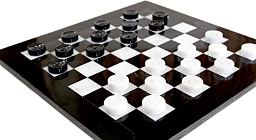 
.small[A classic sequential move game]
]

---
## Game Trees 

.important[A **game tree** is a graphical technique for displaying and analyzing sequential-move games.] 

.pull-left[ 
- Games are essentially sequences of decisions. Each decision in **extensive form** is a **node**. 

- The first move or decision is called the **root node**.  

- Points on the game tree where decisions are made are called **decision** or **action nodes**

- The sequence or path of decisions is shown through **branches** of the game tree.

] 

.pull-right[ 

- Nodes that are arrived at at random are said to have been chosen by **nature**. 

- e.g. we flip a coin to see who goes first $\rightarrow$ "Nature chooses who goes first with equal probability." 

- Nature is not always a 50/50 proposition. Consider a 20% chance of rain that will determine if we play an indoor or outdoor sport.  


] 

---
## Outcomes, Payoffs, & Strategies  

.important[
- **Terminal nodes** are the last nodes on a game tree. 

- They differ from action nodes in that no action is taken. 

- The outcome from the sequence of actions leading to the node is shown. These are the **payoffs**.

- Payoffs guide players' actions through the game. They try to maximize them subject to other players' actions. 

- Payoffs aren't necessarily comparable between players. 

- A single action taken by a player at a node is called a **move**. 

- A plan of action accounting for all eventualities is a **strategy**

]


---

## An Illustrative Game Tree  


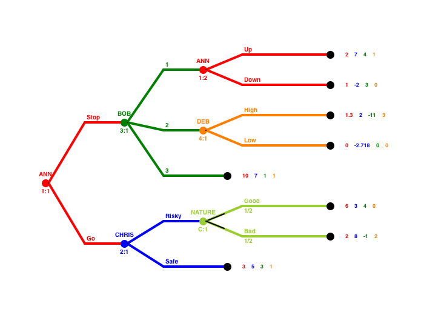   


---
## Game Tree Construction 

.important[ 
- Game trees consist of nodes and branches 

- There are two types of nodes: action and terminal 

- Branches represent possible actions that can be taken 

- There must be at least one branch leading from each decision node 

- Every decision node can have only one branch leading to it 

- Game trees are drawn from left to right or any way that best illustrates the game 
] 

---
class: center, inverse, middle 

# Solving Games By Using Trees 

---
## Solving Games By Using Trees 

.important[ 
- We can use game trees to find equilibrium outcomes 

]

---
## The Smoking Decision 

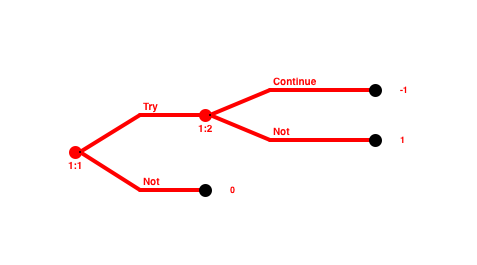 

---
## The Smoking Game & Pruning/Highlighting
We cut off branches of the tree by **pruning** it

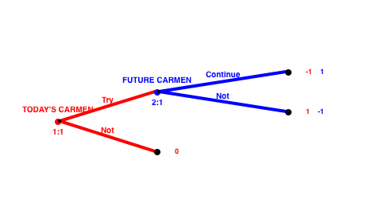 

---
## Solving Games By Using Trees 

.important[ 
- Notice, how we can find the optimal path of gameplay by looking at forecasts of future gameplay 

- The method of looking ahead and reasoning back to determing behavior in sequential move games is called **rollback** 

- **Backward induction** is an older term for rollback but they mean the same thing 

- When all players do rollback analysis to choose their optimal strategies, we call the set of strategies the **rollback equilibrium**  

- I, however, will use the older **subgame perfect equilibrium**, as well as discuss what that means later 

- Note, all finite sequential-move games you will be presented with have at least one solution, often *exactly* one (Where might you have more than one?)
] 

---
## Adding More Players 

.important[In the subsequent slides, we worked in a simple two player, two move setting. It causes no difficulty to extend this.] 

.important[
- Let's add one player 

- All players (Emily, Nina, Talia) live on the same street

- Each player will choose from two actions: to contribute to a community flower garden 

- The aesthetic appeal of the garden is dependent on each person's contribution 

- Everyone wants a garden, but is reticent to contribute 

- Further, suppose that if one or none contribute, the garden will be unappealing. If two or all contribute, the garden will turn some heads
] 

---
## Adding More Players Cont'd 

.important[From each player's perspective there are then four outcomes: 

- She doesn't contribute but the others do 

- She contributes and at least one other neighbor does 

- She doesn't contribute and one or neither neighbor does 

- She contributes but the other neighbors do not 

] 

.important[What does this mean for the player? the garden?] 

---
## The Street Garden Game

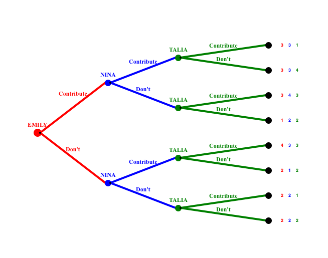

---
## The Street Garden Game  

.important[ 
- When we place arrows over particular actions, we're highlighting a **path of play** 

- Notice that the **equilibrium path of play** of a sequential move game misses most of the branches and nodes 

- Each player has two actions available to them, but a different amount of strategies available to them depending on where they move 
  - Emily has 2
  - Nina has 4 
  - Talia has 16!
] 

---
## Strategies Available To The Players 


---
## Summation Of What We Just Learned 

.large[ 
1. The list of available strategies for each player may become long 

2. The optimal strategy of each player must specify the player's best choices at each node where the rules specify that she moves even if the node is *never* reached in equilibrium 

3. The subgame perfect equilibrium is then found by combining each player's optimal strategy
] 

---
## Order Advantages  

.important[ 
- Emily gets the best outcome in the street-garden game because she has the opportunity to move first 

- The only way the other players get their best possible outcome is by choosing contribute 

- Emily has a **first-mover advantage**, but this does not exist in all games 

- By way of example, imagine two firms selling similar items. The second firm can adjust its prices based on the first firms move 

- First-mover advantages come from the ability to commit oneself to an advantageous position 

- **Second-mover advantages** come from the ability to adapt oneself to another's choices 

- If an $i^{th}$-mover advantage exists, players may attempt to manipulate the order of gameplay
] 

---

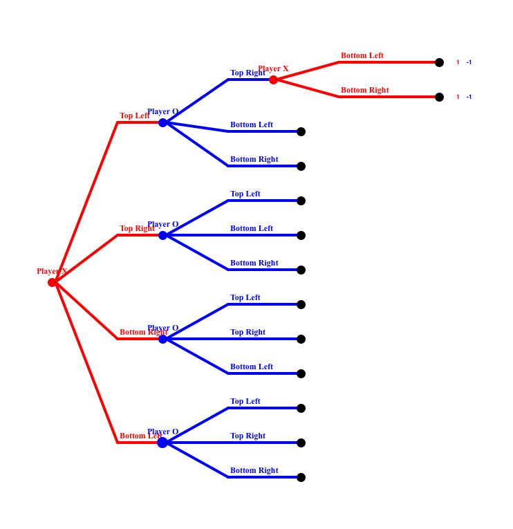
 
---
## Chess 

.right-column[
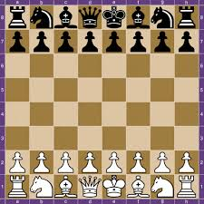
] 
.left-column[
- Tic-tac-toe can be solved using rollback 

- Finding a complete solution to more complex games like chess quickly become untenable  

- In chess, each player has 16 pieces in six distinct shapes 

- Each piece is constrained to a certain type of movement 

- All moves are visible and sequential & the game must end in a finite number of moves 

- Because the game is finite, we *can* do rollback analysis
] 

---
## Chess 

.left-column[
- Chess has not been solved though 

- It becomes complex quite quickly: 20 possible opening moves, 20 possible responses,...  
  totaling $\approx$ $10^{120}$ possible moves


- A human cannot, nor can a computer, fully look ahead. Instead they use an **intermediate value function**, an indirect way of assigning plausible payoffs to nonterminal nodes 

- Chess is most difficult at the "midgame" where "knowledge" plays its most crucial role
] 

.right-pull[ 
 
.small[Chess champion and conqueror of the machine, Gary Kasparov]
] 

---
## Checkers 

.left-column[
- Checkers is another game played on an 8x8 board 

- The number of possible moves in checkers is $\approx 5\times10^{20}$ 

- Theory predicts that checkers should end in a tie but it was finally proven in 2007 

- In computationally complex games we must use a combination of methods: (1) calculation based on the logic of rollback  and (2) rules of thumb for valuing intermediate positions on the basis of experience
]

.right-column[ 
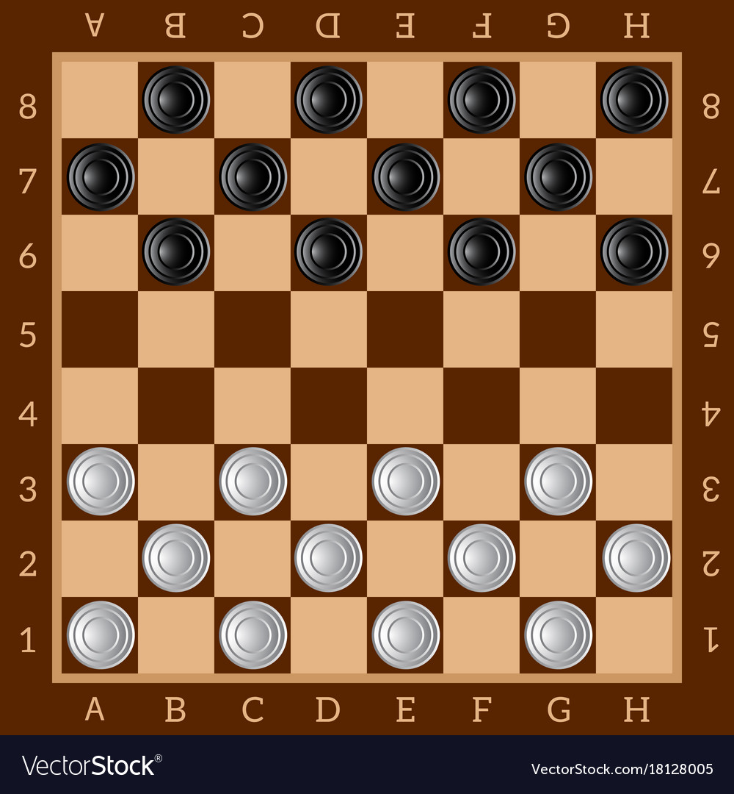
] 

---
## Evidence Concerning Rollback 

.important[How well do players perform rollback analysis? 

- Experimenters had subjects play a game where on person proposes a split of an amount of money & the other accepts the split or declines and each player receives $0 

- Rollback performs poorly in this instance 

- 50/50 is the most common proposal 

- Most players turn down proposals that leave them with less than 25% of the pot] 


---
## The Centipede Game

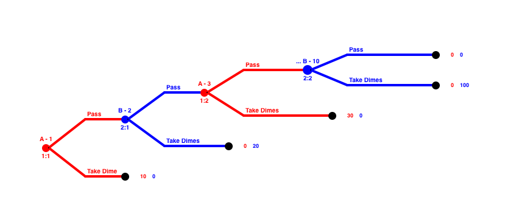 


---
## Strategies In Survivor

.right-column[
- *Survivor* first aired on CBS the summer of 2000 

- A "tribe" was left on an uninhabited island and left to fend for themselves 

- Every three days the contestants had to vote out a member 

- There were immunity challenges before each tribal council 

- Once the tribe reached two members, the previous seven castoffs, the jury, selected the winner 

- The goal then was (1) to be productive, but not too productive, (2) form trustworthy alliances, (3) betray those alliances but not too often, (4) while remaining popular
]
.left-column[
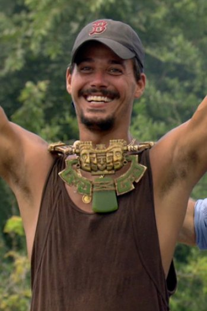 
.small[This is not Rich, who evades taxes]
] 

---
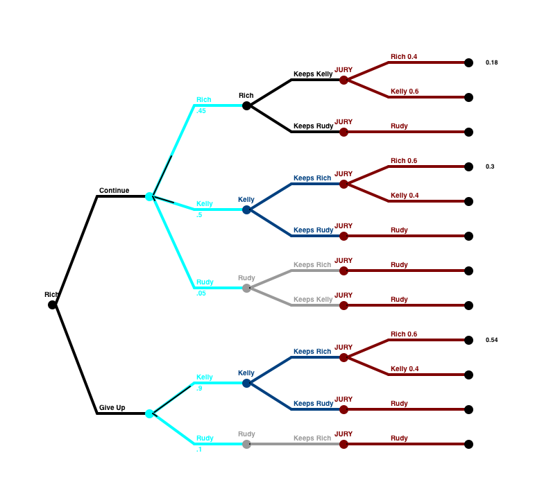 


---
## Summary 

.important[ 
- Sequential-move games require players to consider the future consequences of their current moves 

- To analyze a pure sequential game, we construct game trees 

- The equilibrium concept used in sequential-move games is rollback equilibrium  

- Different types of games involve different types of advantage, a common one is first-mover advantage

- Adding moves or players to the game increases the game's complexity but does not alter the solution process 

- In complex games we try to reduce the dimensionality of the game by noting similar processes 

- Some finite games are both art and science
]

